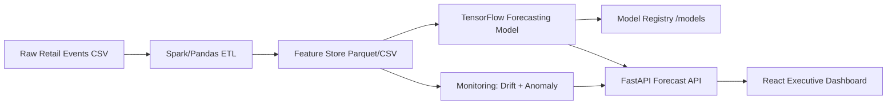

# DemandIQ Enterprise — Big Data Multi-Horizon Demand Forecasting Platform

    

DemandIQ Enterprise is a **Google/Amazon/Microsoft-level portfolio project** for retail demand forecasting. It predicts demand for products across stores over multiple horizons, detects stockout risk, monitors model/data drift, exposes forecasts through FastAPI, and provides a React executive dashboard.

## Why this project is Top 1%

Most forecasting projects stop at one notebook. DemandIQ is a complete **enterprise AI system**:

- Big data dataset generator: 500K to 5M+ rows
- Retail-grade features: store, product, inventory, price, discount, holiday, weather, events, competitor price
- PySpark ETL pipeline with Pandas fallback
- TensorFlow sequence model for multi-horizon forecasting
- Uncertainty bands: lower, expected, upper demand
- Stockout risk and revenue forecast
- Drift and anomaly monitoring
- FastAPI backend with production-style routes
- React + Tailwind + Recharts executive dashboard
- Docker + GitHub Actions CI
- Clean architecture for GitHub and resume showcase

## Architecture



## Business Problem

Retail companies lose money due to poor demand planning:

- Overstock creates storage cost and dead inventory
- Understock causes lost sales and poor customer experience
- Promotions and holidays create sudden demand spikes
- Store/product demand changes over time due to drift

DemandIQ helps business teams answer:

- How much demand will happen in the next 7, 14, 30, and 90 days?
- Which products have stockout risk?
- Which stores need replenishment?
- Is the model becoming stale due to data drift?
- What is the expected revenue impact?

## Tech Stack

| Layer | Tools |
|---|---|
| Data Generation | Python, NumPy, Pandas |
| Big Data ETL | PySpark with Pandas fallback |
| ML/DL | TensorFlow/Keras, Scikit-learn |
| API | FastAPI, Pydantic, Uvicorn |
| Dashboard | React, Vite, Tailwind CSS, Recharts |
| Storage | CSV/Parquet-ready local data lake |
| MLOps | Docker, GitHub Actions, modular pipeline |

## Folder Structure

```text
demandiq_enterprise/
├── backend/                  # FastAPI forecasting backend
├── data/                     # raw and processed datasets
├── frontend/                 # React dashboard
├── models/                   # trained model artifacts
├── reports/                  # metrics, drift reports
├── scripts/                  # data generation/training scripts
├── spark_jobs/               # ETL pipeline
├── docker-compose.yml
└── README.md
```

## Quick Start

### 1. Create environment

```bash
python -m venv .venv
source .venv/bin/activate       # Mac/Linux
# .venv\Scripts\activate      # Windows
pip install -r requirements.txt
```

### 2. Generate dataset

Default creates 500,000 rows.

```bash
python scripts/generate_dataset.py --rows 500000
```

For laptop-friendly testing:

```bash
python scripts/generate_dataset.py --rows 50000
```

### 3. Run ETL

```bash
python spark_jobs/retail_etl.py
```

### 4. Train model

```bash
python scripts/train_tensorflow_forecaster.py
```

### 5. Start backend

```bash
cd backend
uvicorn app.main:app --reload --host 127.0.0.1 --port 8000
```

Open:

```text
http://127.0.0.1:8000/docs
```

### 6. Start frontend

```bash
cd frontend
npm install
npm run dev
```

## API Endpoints

| Endpoint | Method | Purpose |
|---|---:|---|
| `/health` | GET | Backend health check |
| `/api/forecast/summary` | GET | Executive forecast cards |
| `/api/forecast/product/{product_id}` | GET | Product-level forecast |
| `/api/monitoring/drift` | GET | Drift report |
| `/api/monitoring/anomalies` | GET | Demand anomaly list |
| `/api/retrain` | POST | Trigger model retraining placeholder |

## Dataset Schema

| Column | Meaning |
|---|---|
| date | Sales date |
| store_id | Store identifier |
| product_id | Product identifier |
| category | Product category |
| region | Store region |
| price | Product price |
| discount_pct | Discount percentage |
| competitor_price | Competitor price |
| inventory | Available inventory |
| weather_temp | Temperature |
| rainfall_mm | Rainfall |
| holiday_flag | Holiday indicator |
| event_flag | Local event indicator |
| units_sold | Target demand |
| revenue | Revenue generated |

## Model Approach

DemandIQ uses a supervised time-series framing:

- Lookback window: previous 28 days
- Forecast target: next-day demand, extendable to 7/14/30/90-day recursive forecasts
- Model: TensorFlow LSTM
- Loss: MAE
- Evaluation: MAE, RMSE, MAPE
- Uncertainty: residual-based confidence intervals

## Resume Bullet

Built **DemandIQ Enterprise**, an enterprise-scale demand forecasting platform processing 500K+ retail records using PySpark-style ETL, TensorFlow sequence forecasting, FastAPI microservices, React dashboards, and model monitoring to predict multi-horizon demand, detect stockout risk, identify anomalies, and support data-driven inventory planning.

## Interview Explanation

> I built DemandIQ Enterprise to solve a real retail supply chain problem: forecasting demand accurately across stores and products. The project includes dataset generation, ETL, feature engineering, TensorFlow forecasting, monitoring, FastAPI APIs, and React dashboards. I designed it like a production AI system, not just a notebook, so it demonstrates data engineering, machine learning, backend engineering, MLOps, and business storytelling.

## Future Improvements

- Add Kafka streaming ingestion
- Add MLflow experiment tracking
- Add Airflow scheduling
- Add real cloud deployment on AWS/GCP
- Add Prophet/XGBoost baseline comparison
- Add user authentication and role-based dashboards
